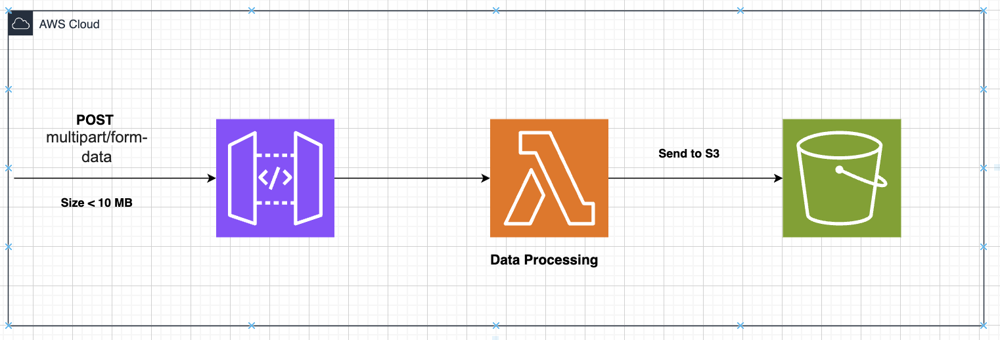

# Processing Service

## Overview
This project aim to processes multipart/form-data POST requests 

## Architecture

## Components
- **API Gateway**: Handles HTTP POST requests and triggers the Lambda function.(file size < 10 MB)
- **AWS Lambda**: Processes the incoming requests, performs validation, and uploads the JSON data to S3.
- **Amazon S3**: Stores the processed JSON data in a client-specific folder.

